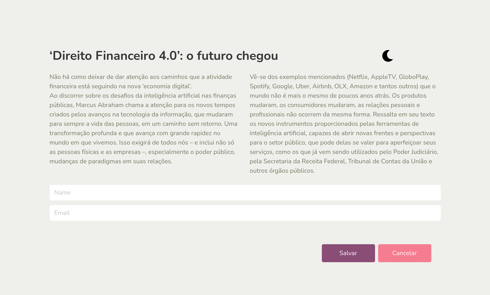
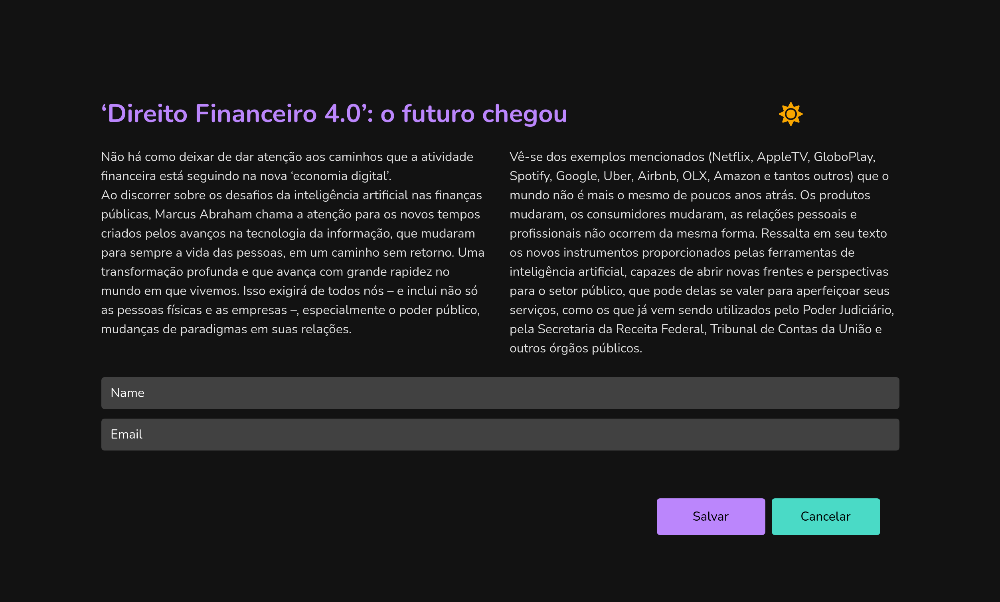

# Teste ReactJS - Front-end - LinkLei

## Instruções

- Crie um fork deste repositório na sua conta no github, como um repositório público, desenvolva seu teste neste fork.
- Você pode realizar commits contínuos, para acompanharmos seu progresso.
- Desenvolver a tela proposta nas imagens abaixo, o mais próximo possivel.
- Criar uma funcionalidade para trocar o tema, ao clicar no ícone da lua/sol.
    - Quando a tela estiver com tema 'light': exibir o ícone da lua (faMoon).
    - Quando a tela estiver com o tema 'dark': exibir o ícone do sul (faSun). 
    - Aternar entre o tema 'light' e 'dark' quando clicado nos respectivos ícones de sol e lua.
- Utilize os rescursos de state e/ou global state do react para alterar os temas.
- Os campos Nome, Email e os botões Salvar, Cancelar não precisam ter funcionalidades implementadas, porém devem ser respectivamente elementos inputs e buttons.
- Manter uma responsividade adequada para a tela, de acordo com as imabens abaixo.
- Aplique os estilos utilizando sass.
- Aplique as cores exatamente como nas imagens de exemplo.
- Utilize código legível e bem estruturado.
- Não esqueça de versionar o package.json e o package-lock.json.
- Descreva no README quaisquer instruções para execução do projeto, priorizando a execução em linux.

## Modelos de telas:

**light-mode:** 

**dark-mode:** 

**responsivo:** 

----
## As dicas abaixo serão consideradas na avaliação do seu teste:
- Para utilizar os ícones de sol e lua, utilize a biblioteca [react-fontawesome](https://github.com/FortAwesome/react-fontawesome), [documentação aqui](https://fontawesome.com/v5.15/how-to-use/on-the-web/using-with/react).
- Demonstre conhecimento utilizando o [react-bootstrap](https://react-bootstrap.github.io/getting-started/introduction) na construção do layout.
- Utilize as seguintes bibliotecas atualizadas:
    - [sass](https://www.npmjs.com/package/sass)
    - react
    - react-dom
    - react-scripts